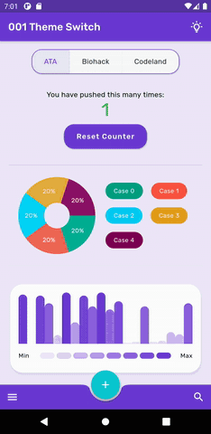

<h2 align="center">001 - THEME SWITCH</h2>

In this series of articles, I talk about implementing a design system
for a Flutter app so that we can easily switch between three themes made
for three different companies.



Imagine you have a B2B app to be used by the customers or employers of
different companies. You can choose to implement only one app theme for
all companies. Alternatively, your app can apply company-specific themes
to increase brand awareness when a user is identified.

It may sound like a big cost to maintain multiple themes in an app, but
when carefully done, it is actually not a big deal. In fact, it forces
you to write cleaner code with separate concerns and less repetition.

There are many blog posts and tutorials on switching between dark and
light themes in Flutter. However, brightness is only one aspect of a
theme. A theme is a collection of attributes that are applied to all
screens of an application. In this article, I discuss how to apply 3
different themes in an app and switching between them.

The distinct theme properties will be color, typography, icons, shape,
and brightness. In the demo project, I implemented themes for the
following imaginary companies: ATA, Biohack, and Codeland. Note that in
the app there are intentional design mistakes which are mentioned in
these posts for demonstration purposes.


Here are the links for the articles:

<li> <a href= "https://medium.com/@ulusoyca/switching-between-client-specific-themes-for-b2b-flutter-apps-part-i-design-c9c501700c0e">Switching Between Client Specific Themes for B2B Flutter Apps - Part I: Design</li>
<li> <a href= "https://medium.com/swlh/switching-between-client-specific-themes-for-b2b-flutter-apps-part-ii-development-9b0f5e49317">Switching Between Client Specific Themes for B2B Flutter Apps - Part II: Implementation</li>

#### Usage (Theme Switch )
To start the app with the command line, first open an iOS simulator,
Android Virtual device, or a physical device. Then type the following
commands on the command line:

```
cd 001-theme-switch-with-provider && flutter run -d chrome lib/main.dart
```