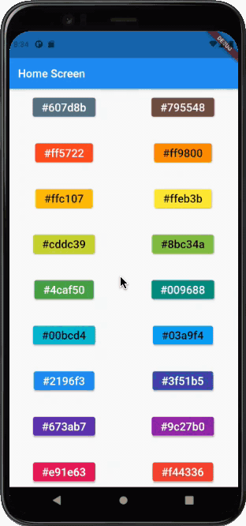
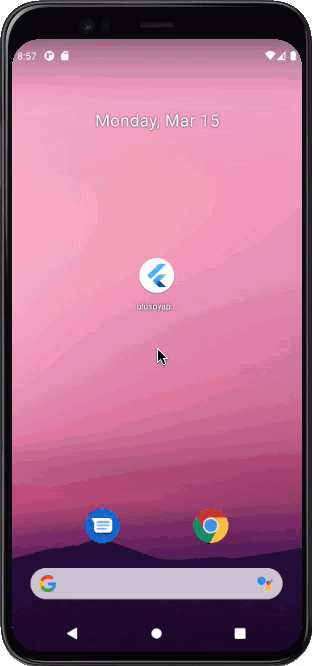
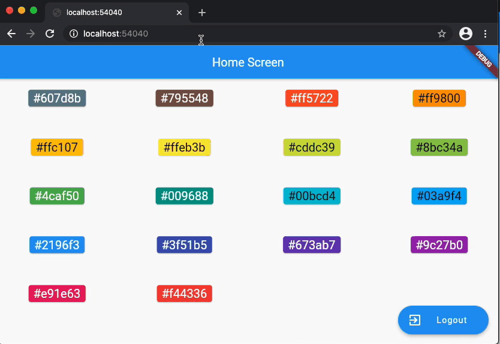

<h2 align="center">002 - NAVIGATOR 2.0</h2>

<a href= "https://ulusoyca.medium.com/flutter-navigator-2-0-for-authentication-and-bootstrapping-part-1-introduction-d7b6dfdd0849">Flutter Navigator 2.0 for Authentication and Bootstrapping — Part 1: Introduction</a>

<p>The Navigator 2.0 API gives more control to Flutter developers to implement the application navigation by introducing multiple components with separated responsibilities. When it was announced, many Flutter devs, including me, initially found this new way of navigation complicated and hard to use due to the lack of training materials and samples. The Flutter team is well aware of this situation, and they started
Navigator 2.0 API Usability Research. Anyone can contribute to this research project and engage in the discussions.</p>
<p>I was too close to give up on migrating to the new Navigator API too, but I wanted to get benefit from it for my side project to provide a better Web application user experience. After going through the source code, reading the Github discussions, and experimenting a lot with a demo project, I would like to share my learnings in this series of articles.</p>
<p>The Flutter team presented the Navigator 2.0 API with an article that gives too much information to digest. I think the article could have been split into smaller parts and covered more common scenarios such as authentication, bootstrapping, deep-link handling, etc. I am sure many blog posts from the Flutter community will help to close this gap. I also hope that this series of articles will be useful for the community.</p>

### PART 2: User Interaction

<a href= "https://ulusoyca.medium.com/flutter-navigator-2-0-for-authentication-and-bootstrapping-part-2-user-interaction-5dc043e7e44a">Flutter Navigator 2.0 for Authentication and Bootstrapping — Part 2: User Interaction</a>

<p>In the first sample app, we introduce the Router widget and its delegates. Then we explain how to build a navigation stack according to the app state changes. We focus on the following user interactions causing the app state changes:</p>
<li>Selecting a color and shape border type by pressing the buttons in the lists</li>
<li>Pressing the back button in the app bar</li>
<li>Pressing the system back button (Android only)</li>
<br/>



#### Usage (Part-2):
To start the app with the command line, first open an iOS simulator,
Android Virtual device, or a physical device. Then type the following
commands on the command line:

```
cd 002-navigator2 && flutter run -d chrome lib/002-01-mobile-only/main_002_01.dart
```
<br/>
<br/>

### PART 3: Authentication

<a href= "https://ulusoyca.medium.com/flutter-navigator-2-0-for-authentication-and-bootstrapping-part-3-authentication-93dbcb5f0f0a">Flutter Navigator 2.0 for Authentication and Bootstrapping — Part 3: Authentication</a>

<p>In the second sample, we add the authentication use case and build the navigation stack according to the authentication state changes.</p>
<br/>


#### Usage (Part-3):
To start the app with the command line, first open an iOS simulator,
Android Virtual device, or a physical device. Then type the following
commands on the command line:

```
cd 002-navigator2 && flutter run -d chrome lib/002-02-mobile-only-with-auth/main_002_02.dart
```
<br/>
<br/>

### PART 4: Bootstrapping

<a href= "https://ulusoyca.medium.com/flutter-navigator-2-0-for-authentication-and-bootstrapping-part-4-bootstrapping-6ff60c845331">Flutter Navigator 2.0 for Authentication and Bootstrapping — Part 4: Bootstrapping</a>

<p>In the fourth sample, we we handle the bootstrapping process and build the navigation stack accordingly.</p>
<br/>



#### Usage (Part-4):
To start the app with the command line, first open an iOS simulator,
Android Virtual device, or a physical device. Then type the following
commands on the command line:

```
cd 002-navigator2 && flutter run -d chrome lib/002-03-mobile-only-with-auth-and-bootstrap/main_002_03.dart
```
<br/>
<br/>

### PART 5: Web

<a href= "https://ulusoyca.medium.com/flutter-navigator-2-0-for-authentication-and-bootstrapping-part-5-web-eeb4835804df">Flutter Navigator 2.0 for Authentication and Bootstrapping — Part 5: Web</a>

<p>In the fourth sample, we focus on two things:</p>
<li>Application state changes caused by user interaction, authentication state update, and bootstrapping.</li>
<li>Popping the current route requests from the operating system.</li>
<br/>



#### Usage (Part-5):
To start the app with the command line type the following commands on the command line:

```
cd 002-navigator2 && flutter run -d chrome lib/002-04-mobile-and-web-with-auth-and-bootstrap/main_002_04.dart
```