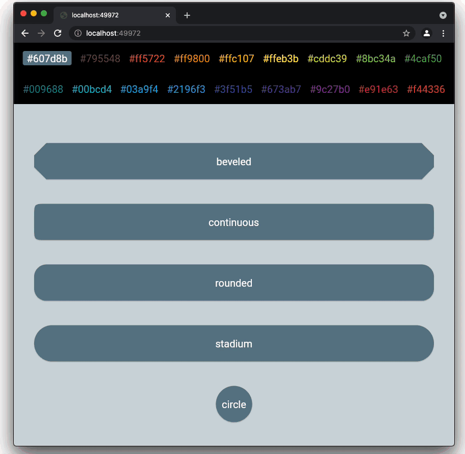

<h1 align="center">Welcome to Flutter ShareWhatYouKnow 👋</h1>
<p>
  <a href="http://www.apache.org/licenses/LICENSE-2.0" target="_blank">
    
  </a>
  <a href="https://twitter.com/ulusoyapps" target="_blank">
    
  </a>
</p>

In this Github repository I share the source code for the tutorial articles that I published. You can find the links to the articles below. Please follow my <a href= "https://ulusoyca.medium.com">Medium page</a> to stay up-to-date whenever I share a new content!
<br/>
<br/>
<br/>

<h2 align="center">001 - THEME SWITCH</h2>

In this series of articles, I talk about implementing a design system
for a Flutter app so that we can easily switch between three themes made
for three different companies.


Imagine you have a B2B app to be used by the customers or employers of
different companies. You can choose to implement only one app theme for
all companies. Alternatively, your app can apply company-specific themes
to increase brand awareness when a user is identified.

It may sound like a big cost to maintain multiple themes in an app, but
when carefully done, it is actually not a big deal. In fact, it forces
you to write cleaner code with separate concerns and less repetition.

There are many blog posts and tutorials on switching between dark and
light themes in Flutter. However, brightness is only one aspect of a
theme. A theme is a collection of attributes that are applied to all
screens of an application. In this article, I discuss how to apply 3
different themes in an app and switching between them.

The distinct theme properties will be color, typography, icons, shape,
and brightness. In the demo project, I implemented themes for the
following imaginary companies: ATA, Biohack, and Codeland. Note that in
the app there are intentional design mistakes which are mentioned in
these posts for demonstration purposes.


Here are the links for the articles:

<li> <a href= "https://medium.com/@ulusoyca/switching-between-client-specific-themes-for-b2b-flutter-apps-part-i-design-c9c501700c0e">Switching Between Client Specific Themes for B2B Flutter Apps - Part I: Design</li>
<li> <a href= "https://medium.com/swlh/switching-between-client-specific-themes-for-b2b-flutter-apps-part-ii-development-9b0f5e49317">Switching Between Client Specific Themes for B2B Flutter Apps - Part II: Implementation</li>

#### Usage (Theme Switch )
To start the app with the command line, first open an iOS simulator,
Android Virtual device, or a physical device. Then type the following
commands on the command line:

```sh
flutter run lib/001-theme-switch-with-providers/main.dart
```
<br/>
<br/>
<br/>

<h2 align="center">002 - NAVIGATOR 2.0</h2>

<a href= "https://ulusoyca.medium.com/flutter-navigator-2-0-for-authentication-and-bootstrapping-part-1-introduction-d7b6dfdd0849">Flutter Navigator 2.0 for Authentication and Bootstrapping — Part 1: Introduction</a>

<p>The Navigator 2.0 API gives more control to Flutter developers to implement the application navigation by introducing multiple components with separated responsibilities. When it was announced, many Flutter devs, including me, initially found this new way of navigation complicated and hard to use due to the lack of training materials and samples. The Flutter team is well aware of this situation, and they started
Navigator 2.0 API Usability Research. Anyone can contribute to this research project and engage in the discussions.</p>
<p>I was too close to give up on migrating to the new Navigator API too, but I wanted to get benefit from it for my side project to provide a better Web application user experience. After going through the source code, reading the Github discussions, and experimenting a lot with a demo project, I would like to share my learnings in this series of articles.</p>
<p>The Flutter team presented the Navigator 2.0 API with an article that gives too much information to digest. I think the article could have been split into smaller parts and covered more common scenarios such as authentication, bootstrapping, deep-link handling, etc. I am sure many blog posts from the Flutter community will help to close this gap. I also hope that this series of articles will be useful for the community.</p>

### PART 2: User Interaction

<a href= "https://ulusoyca.medium.com/flutter-navigator-2-0-for-authentication-and-bootstrapping-part-2-user-interaction-5dc043e7e44a">Flutter Navigator 2.0 for Authentication and Bootstrapping — Part 2: User Interaction</a>

<p>In the first sample app, we introduce the Router widget and its delegates. Then we explain how to build a navigation stack according to the app state changes. We focus on the following user interactions causing the app state changes:</p>
<li>Selecting a color and shape border type by pressing the buttons in the lists</li>
<li>Pressing the back button in the app bar</li>
<li>Pressing the system back button (Android only)</li>
<br/>


#### Usage (Part-2):
To start the app with the command line, first open an iOS simulator,
Android Virtual device, or a physical device. Then type the following
commands on the command line:

```
cd 002-navigator2 && flutter run -d chrome lib/002-01-mobile-only/main_002_01.dart
```
<br/>
<br/>

### PART 3: Authentication

<a href= "https://ulusoyca.medium.com/flutter-navigator-2-0-for-authentication-and-bootstrapping-part-3-authentication-93dbcb5f0f0a">Flutter Navigator 2.0 for Authentication and Bootstrapping — Part 3: Authentication</a>

<p>In the second sample, we add the authentication use case and build the navigation stack according to the authentication state changes.</p>
<br/>


#### Usage (Part-3):
To start the app with the command line, first open an iOS simulator,
Android Virtual device, or a physical device. Then type the following
commands on the command line:

```
cd 002-navigator2 && flutter run -d chrome lib/002-02-mobile-only-with-auth/main_002_02.dart
```
<br/>
<br/>

### PART 4: Bootstrapping

<a href= "https://ulusoyca.medium.com/flutter-navigator-2-0-for-authentication-and-bootstrapping-part-4-bootstrapping-6ff60c845331">Flutter Navigator 2.0 for Authentication and Bootstrapping — Part 4: Bootstrapping</a>

<p>In the fourth sample, we we handle the bootstrapping process and build the navigation stack accordingly.</p>
<br/>


#### Usage (Part-4):
To start the app with the command line, first open an iOS simulator,
Android Virtual device, or a physical device. Then type the following
commands on the command line:

```
cd 002-navigator2 && flutter run -d chrome lib/002-03-mobile-only-with-auth-and-bootstrap/main_002_03.dart
```
<br/>
<br/>

### PART 5: Web

<a href= "https://ulusoyca.medium.com/flutter-navigator-2-0-for-authentication-and-bootstrapping-part-5-web-eeb4835804df">Flutter Navigator 2.0 for Authentication and Bootstrapping — Part 5: Web</a>

<p>In the fourth sample, we focus on two things:</p>
<li>Application state changes caused by user interaction, authentication state update, and bootstrapping.</li>
<li>Popping the current route requests from the operating system.</li>
<br/>


#### Usage (Part-5):
To start the app with the command line type the following commands on the command line:

```
cd 002-navigator2 && flutter run -d chrome lib/002-04-mobile-and-web-with-auth-and-bootstrap/main_002_04.dart
```

<br/>
<br/>
<br/>

<h2 align="center">003 - SINGLE PAGE SCROLLABLE WEBSITE WITH NAVIGATOR 2.0</h2>

<a href= "https://medium.com/flutter-community/flutter-for-single-page-scrollable-websites-with-navigator-2-0-part-1-introduction-c219b471bbec">Flutter for Single-Page Scrollable Websites with Navigator 2.0 — Part 1: Introduction</a>

<p>Single page scrollable websites are everywhere. In this website design pattern, all the content is presented in one long-scrolling layout that contains multiple sections. Visitors can scroll or jump to a section by clicking buttons of a sticky menu. This pattern is a good fit for small content such as brochure websites, software library documentation, portfolios, and landing pages that are used to convert users. Designers also love this pattern because it is simple, clean, and enables cool scroll animations.</p>
<p>In this series of articles, we will explore how to build a single-page scrollable website using Flutter. We will benefit from the Navigator 2.0 API to provide a good navigation experience to the users.</p>
<p>
We want to achieve the following goals for our single page scrollable website samples:
<li>Clicking a button in the top or side navigation menu bar will scroll the page to the
corresponding section</li>
<li>The URL on the Web browser’s address bar should be updated according to the button clicks on
the navigation menu and the first visible section as the user scrolls on the home page.</li>
<li>When the user enters a URL on the address bar, the Web application should show the corresponding section.</li>
<li>When the Web browser’s back and forward buttons are clicked the URL on the address bar and the first visible section should be updated correctly.</li>
<li>If the user types an unknown path in the address bar, a page with an error text is shown to the user.</li>
</p>
<br/>
<br/>

### PART 2: Scroll To Position

<a href= "https://levelup.gitconnected.com/flutter-for-single-page-scrollable-websites-with-navigator-2-0-part-2-scroll-to-position-4c09cbc9d975">Flutter for Single-Page Scrollable Websites with Navigator 2.0 — Part 2: Scroll To Position</a>

<p>In the first sample app, we will build the scrollable content using the ListView.builder constructor. Calling this method creates a ListView whose items are created lazily (on-demand). The itemBuilder parameter creates an item for a given index and it is called when the index is visible as the user scrolls onto the screen.</p>
<br/>



#### Usage (Part-2):
To start the app with the command line type the following commands on the command line:

```
003-single-page-scrollable-website && flutter run -d chrome lib/003-01-scroll-to-position/main_003_01.dart
```
<br/>
<br/>

### PART 3: Scroll to Page

<a href= "https://medium.com/geekculture/flutter-for-single-page-scrollable-websites-with-navigator-2-0-part-3-scroll-to-page-30b6c43bd41">Flutter for Single-Page Scrollable Websites with Navigator 2.0 — Part 3: Scroll to Page</a>

<p>The second sample app is very similar to the first sample app. In this sample, we will use PageView instead of ListView . PageView widget is a scrollable list whose children have the same size which is equal to the viewport size by default. Each item in the list is called a page. We can consider the PageView widget as a ListView but more tailored for items of equal size.</p>
<br/>


#### Usage (Part-3):
To start the app with the command line type the following commands on the command line:

```
cd 003-single-page-scrollable-website && flutter run -d chrome lib/003-02-scroll-to-page/main_003_02.dart
```
<br/>
<br/>

### PART 4: Ensure Visible

<a href= "https://ulusoyca.medium.com/flutter-for-single-page-scrollable-websites-with-navigator-2-0-part-4-ensure-visible-145eba88d742">Flutter for Single-Page Scrollable Websites with Navigator 2.0 — Part 4: Ensure Visible</a>

<p>In the third sample app, we will learn how to live with the expense of laying out all the list items with various heights. We will use SingleChildScrollView which is a scrollable box usually used with a Column . To achieve the scroll requirements, we will do the following:</p>
   <li>Create a widget list containing all the color section widgets.</li>
   <li>Assign a GlobalKey to each section widget.</li>
   <li>Set the color section widget list as the children of the Column widget and provide the Column to the SingleChildScrollView as its child.</li>
   <li>When we want to scroll to an index programmatically, we will get the GlobalKey of the color section widget and provide the currentContext of the GlobalKey as a parameter to Scrollable.</li>
<p>The ensureVisible method ensures that the widget with the given context is visible.</p>
<p>Note that this way of scrolling to an item is the most expensive one among all options in terms of performance. If the number of the sections are small, and the sections are not content-heavy, using SingleChildScrollView + Column could be the easiest solution.</p>
<br/>


#### Usage (Part-4):
To start the app with the command line type the following commands on the command line:

```
cd 003-single-page-scrollable-website && flutter run -d chrome lib/003-03-ensure-visible/main_003_03.dart
```
<br/>
<br/>

### PART 5: Scroll To Index

<a href= "https://ulusoyca.medium.com/flutter-for-single-page-scrollable-websites-with-navigator-2-0-part-5-scroll-to-index-c38ed06ddf08">Flutter for Single-Page Scrollable Websites with Navigator 2.0 — Part 5: Scroll To Index</a>

<p>In the previous samples, we utilized Flutter’s built-in solutions for creating a list of sections either lazily or at once. There is still a less expensive way of laying out the list items with unpredictable height on-demand (lazily) and scroll to an index thanks to the Scrollable Positioned List library by google.dev.</p>
   This library solves jumping to a section that has not yet laid out in a very clever way:
   <li>If the destination section index is too far from the current index (not yet laid out), the widget uses a new list in addition to the current one.</li>
   <li>The scrolling is started in both lists at the same pace.</li>
   <li>The newly created list fades over the old list and starts showing the items that are close to the target.</li>
   <li>When the scrolling reaches the target, the newly created list is already fully visible and stops.</li>
   <li>The offset of the new list is set to 0 and the old list becomes invisible.</li>
<br/>


#### Usage (Part-5):
To start the app with the command line type the following commands on the command line:

```
cd 003-single-page-scrollable-website && flutter run -d chrome lib/003-04-scroll-to-index/main_003_04.dart
```
<br/>
<br/>

### PART 7: Query Params

<a href= "https://ulusoyca.medium.com/flutter-for-single-page-scrollable-websites-with-navigator-2-0-part-7-query-params-deb0acfe09fa">Flutter for Single-Page Scrollable Websites with Navigator 2.0 — Part 7: Query Params</a>

<p>In the last 4 sample apps, we use path segments with path variables in URLs:</p>
<li>constant colors text as the first path segment</li>
<li>a path variable that stands for hex color code as the second path segment</li>
<li>a shape border type path variable as the third segment</li>

```
http://localhost:57155/colors/ffeb3b/circle
```

<p>In the fifth sample app, we will use query parameters in URLs with one path segment called section which contains two query parameters color and borderType.</p>

```
http://localhost:57073/section?color=ffeb3b&borderType=circle
```

<br/>


#### Usage (Part-7):
To start the app with the command line type the following commands on the command line:

```
cd 003-single-page-scrollable-website && flutter run -d chrome lib/003-05-query-params/main_003_05.dart
```

## Author

👤 **Cagatay Ulusoy**

* Twitter: [@ulusoyapps](https://twitter.com/ulusoyapps)
* Github: [@ulusoyca](https://github.com/ulusoyca)
* LinkedIn:
  [@https:\/\/www.linkedin.com\/in\/cagatayulusoy\/](https://linkedin.com/in/https:\/\/www.linkedin.com\/in\/cagatayulusoy\/)

## Show your support

Give a ⭐️ if this project helped you!

## 📝 License

Copyright © 2020 [Cagatay Ulusoy](https://github.com/ulusoyca).<br />
This project is
[Apache License, Version 2.0 (the &#34;License&#34;)](http://www.apache.org/licenses/LICENSE-2.0)
licensed.

***

_This README was generated with ❤️ by
[readme-md-generator](https://github.com/kefranabg/readme-md-generator)_
